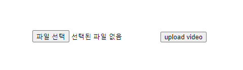

# 📼Upload Video _with Next.js_

 + [Project](#project)
 + [Dependency](#dependency)
 + [Component](#component)
 + [API](#api)
 + [Next_Step](#next-step)


## Project
***

이번 프로젝트에서는 video streaming 사이트 개발을 하기로 해본다.
단순하게 video를 업로드하고 서버에서 스트리밍 하는 기능을 구현함으로 video 플랫폼의 원리를 이해하는 것을 목표로 하였다. 
클라이언트는 React 프레임워크인 [Next.js](https://nextjs.org/)를 사용하였다.

처음에는 사용자가 전송한 video 파일을 서버에서 Buffer로 받아 DB로 저장하려고 하였다.
하지만 다수의 사용자가 영상을 동시에 올려려 한다면 스트리밍도 해야하는 서버에 부담이 될 수도 있다. 때문에 서버는 스트리밍하는 역할만 담당하고 업로드는 클라이언트에서 담당하게 하여 역할을 분리하였다.

<br/>
- Upload flow


<br/>

## Dependency
***

[mongodb](https://www.npmjs.com/package/mongodb)

[axios](https://axios-http.com/)

[busboy](https://www.npmjs.com/package/busboy)

`yarn create next-app --typescript`

`yarn add mongodb axios busboy @types/busboy -D`

<br/>

## Component
***

+ setFile to useState

```typescript
const setFileHandler: React.ChangeEventHandler<HTMLInputElement> = (event: React.ChangeEvent<HTMLInputElement>) => {
    const files = event.target.files;

    if (files?.length) {
        setFile(files[0]);
    }
}
```
<br/>

+ submit to `/api/videos` page

```Typescript
const submitHandler: React.MouseEventHandler<HTMLButtonElement> = async () => {
    const data = new FormData;

    if (!file) return;

    setSubmitting(true);
    data.append('file', file);

    // upload percentage
    // progressEvent info (https://developer.mozilla.org/en-US/docs/Web/API/ProgressEvent)
    const config: AxiosRequestConfig = {
        onUploadProgress: function (progressEvent) {
            let percentage = Math.round((progressEvent.loaded * 100) / progressEvent.total);
            setProcess(percentage);
        }
    };

    try {
        await axios.post('/api/videos', data, config);
        console.log(`video upload is Done.`);
    } catch (error: any) {
        setError(error.message);
    } finally {
        setSubmitting(false);
        setProcess(0);
    }
}
```

<br/>


<br/>

## API
***

+ upload Video to DB
> what is **[GridFS](https://github.com/gkdfo40/TIL/blob/main/GridFS.md)** ??

```typescript
async function uploadVideoStream(
    req: NextApiRequest,
    res: NextApiResponse
) {
    const bb = busboy({ headers: req.headers });
    const client: MongoClient = new MongoClient(dbUri);
    await client.connect();
    const db: Db = client.db('videos');
    const bucket = new GridFSBucket(db);
    bb.on('file', (name, file, info) => {
        const { filename, encoding, mimeType } = info;
        console.log(`File[${name}]: filename: ${filename}, encoding: ${encoding}, mimeType: ${mimeType}`);

        const videoUploadStream = bucket.openUploadStream(filename, {
            chunkSizeBytes: 3145728,
            metadata: { field: "free", value: "vlog" }
        });
        file.pipe(videoUploadStream);
    });
    bb.on('close', () => {
        console.log('Done parsing video!');
        res.writeHead(200, { 'Connection': 'close' });
        res.end(`That's all folks`);
    });
    req.pipe(bb);
    return;
}
```

<br/>

## Next Step

🦄🦄 **Video List viewer & streaming server**